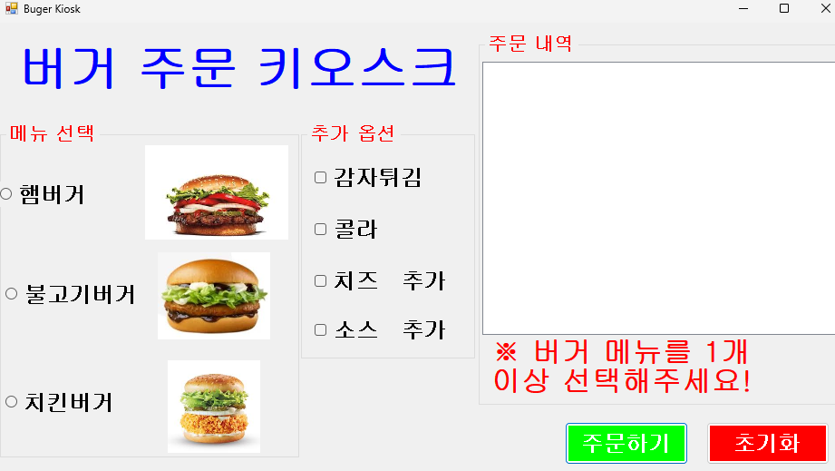
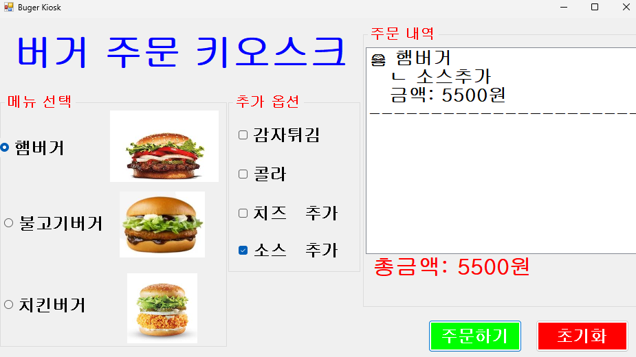
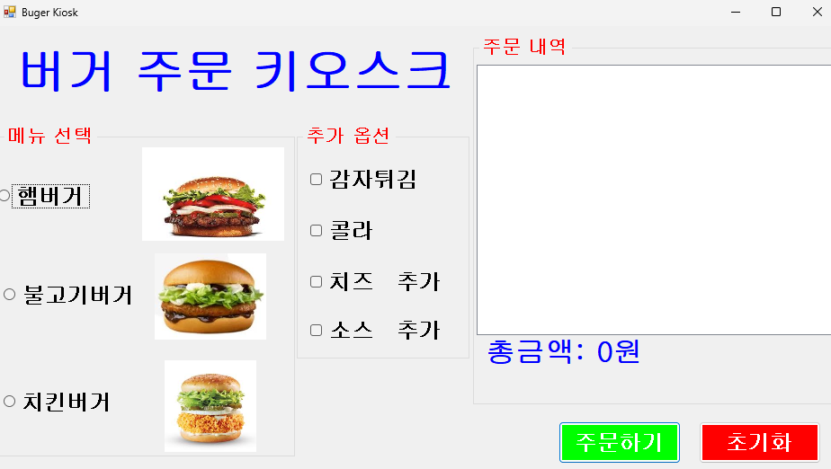
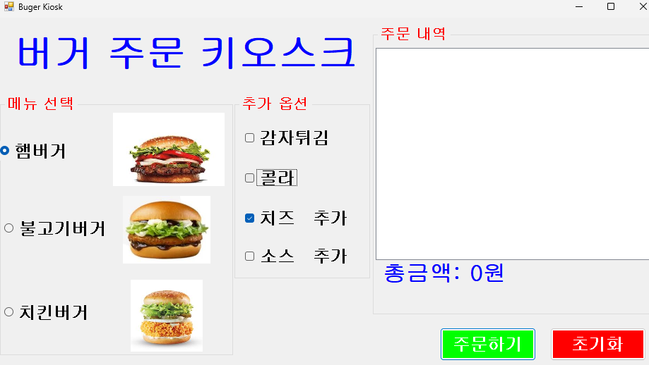
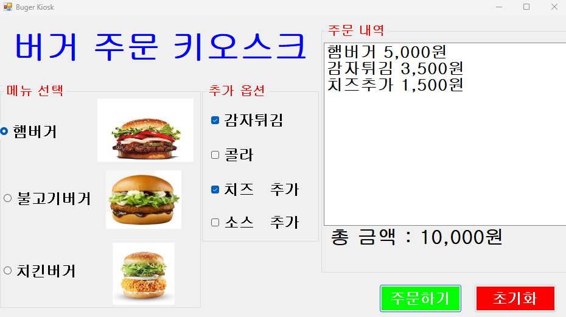
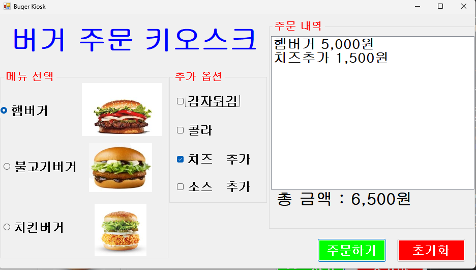

# (C# 코딩) 버거 키오스크

## 개요

-C# 프로그래밍학습

-1줄소개: 메뉴와추가옵션을선택하는키오스크주문화면제작

-사용한플랫폼: 
    -C#, .NET Windows Forms, Visual Studio, GitHub

-사용한컨트롤:-CheckBox, RadioButton, Label, Button, GroupBox, Checked, Text, Enabled, ToString(), Clear(), Click

-사용한기술과구현한기능:
    -키오스크주문화면구현§메뉴선택(단일선택) + 추가옵션(복수선택)
    -선택결과를주문내역에표시 / 선택한항목들보여주기
    -총금액자동계산 / 선택된항목을합산 / 총금액출력
    -초기화버튼 / 처음부터다시주문

## 실행화면
-코드의실행스크린샷과구현내용설명

-구현한내용(위그림참조)
    -Visual Studio를 이용한 UI 디자인: GroupBox, RadioButton, CheckBox 등 다양한 컨트롤을 배치하여 실제 키오스크와 유사한 화면 구성

    -조건문(if ~ else if)을 활용한 논리적 분기 처리: 버거(단일 선택)와 추가 옵션(다중 선택)의 특성에 맞춰 조건문을 다르게 적용하여 주문 로직 구현

    -string 및 int 자료형을 활용한 데이터 처리: 선택된 메뉴 이름들을 하나의 문자열로 결합하고, 메뉴별 가격을 정수형 변수에 누산하여 결제 로직 처리

    -컨트롤 속성(Text, ForeColor, Checked) 동적 제어: 에러 발생 시 글자 색상을 붉은색으로 변경하거나, 초기화 시 체크 상태를 해제하는 등 상황에 맞춘 화면 업데이트 구현
    

## 실행화면
-코드의실행스크린샷과구현내용설명

-구현한내용(위그림참조)
    -주문 내역: 리스트박스에 주문 내역이 출력되게끔 구현함. (메인 버거 이름, 선택된 추가 옵션들, 개별 주문 금액)
    그리고 줄 분리를 하여 선택 메뉴를 여러 개 선택해도 가독성이 좋음.

    -경고 메시지: 버거를 선택하지 않고 주문했을 때 나타나는 버거 1개 이상 선택하라는 붉은색 경고 메시지를 구현함.

    -리스트 메뉴: 4개의 체크박스 상태를 각각 검사하여, 선택된 옵션이 있을 때만 즉각적으로 리스트박스에 깔끔한 주문 내역을 완성함.

## 실행화면
-코드의실행스크린샷과구현내용설명

-구현한내용(위그림참조)
    -키보드 최적화: 마우스 조작 없이 키보드만으로 전체 주문(메뉴 선택 -> 옵션 추가 -> 결제)이 완벽하게 동작하도록 탭 순서와 엔터키로 결제 버튼 입력을 구현함.

    -라디오버튼의 단일 선택: 버거를 고르는 라디오버튼 그룹 내에서는 방향키 이동 시 포커스 이동과 동시에 자동으로 항목이 선택되도록 구현해서, 사용자의 입력 피로도를 줄임.

    -체크박스의 다중 선택: 추가 옵션 그룹에서는 방향키나 Tab으로 포커스만 이동시키고, '스페이스바'를 누를 때만 선택/해제가 이루어지도록 구현함.

## 실행화면
-코드의실행스크린샷과구현내용설명

-구현한내용(위그림참조)
    -실시간 적용 변수: 중복 코드를 방지하고, 영수증 내용 갱신과 총 금액 계산을 분리하여 구현함.

    -컨트롤 이벤트 매핑: 이벤트 설정을 활용하여, UI상의 컨트롤 상태 변화가 이벤트로 즉각적으로 연결함.

    -Form 속성을 이용한 키보드 제어: 특정 컨트롤에 포커스가 없어도 키보드 동작을 하기 위해 폼 속성을 설정함.