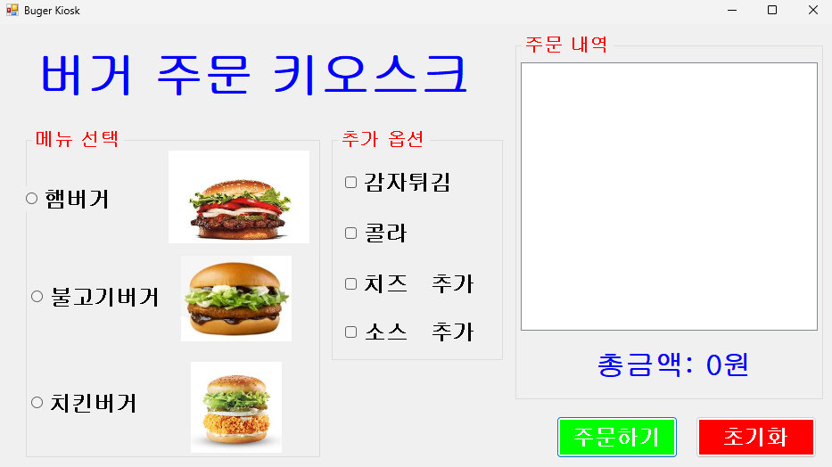

# (C# 코딩) 버거 키오스크

## 개요

-C# 프로그래밍학습

-1줄소개: 메뉴와추가옵션을선택하는키오스크주문화면제작

-사용한플랫폼: 
    -C#, .NET Windows Forms, Visual Studio, GitHub

-사용한컨트롤:-CheckBox, RadioButton, Label, Button, GroupBox, Checked, Text, Enabled, ToString(), Clear(), Click

-사용한기술과구현한기능:
    -키오스크주문화면구현§메뉴선택(단일선택) + 추가옵션(복수선택)
    -선택결과를주문내역에표시 / 선택한항목들보여주기
    -총금액자동계산 / 선택된항목을합산 / 총금액출력
    -초기화버튼 / 처음부터다시주문

## 실행화면
-코드의실행스크린샷과구현내용설명

-구현한내용(위그림참조)
    -Visual Studio를 이용한 UI 디자인: GroupBox, RadioButton, CheckBox 등 다양한 컨트롤을 배치하여 실제 키오스크와 유사한 화면 구성

    -조건문(if ~ else if)을 활용한 논리적 분기 처리: 버거(단일 선택)와 추가 옵션(다중 선택)의 특성에 맞춰 조건문을 다르게 적용하여 주문 로직 구현

    -string 및 int 자료형을 활용한 데이터 처리: 선택된 메뉴 이름들을 하나의 문자열로 결합하고, 메뉴별 가격을 정수형 변수에 누산하여 결제 로직 처리

    -컨트롤 속성(Text, ForeColor, Checked) 동적 제어: 에러 발생 시 글자 색상을 붉은색으로 변경하거나, 초기화 시 체크 상태를 해제하는 등 상황에 맞춘 화면 업데이트 구현
    

## 실행화면
-코드의실행스크린샷과구현내용설명

-구현한내용(위그림참조)
    -

## 실행화면
-코드의실행스크린샷과구현내용설명

-구현한내용(위그림참조)
    -

## 실행화면
-코드의실행스크린샷과구현내용설명

-구현한내용(위그림참조)
    -